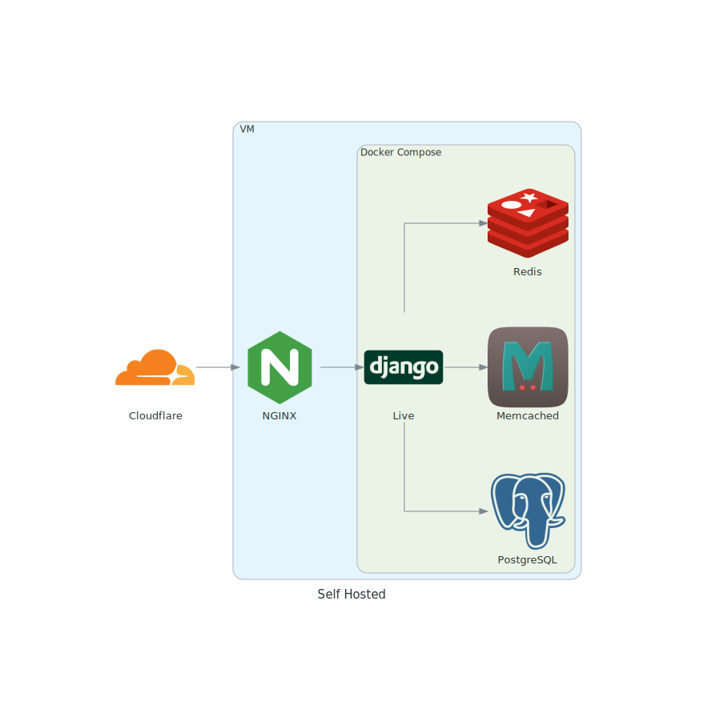

# HackTJ Live

## Deployment



The image above shows the setup that was used for HackTJ 7.5 HackTJ Live 1.0.0 was deployed for HackTJ 7.5 in a VM using docker-compose and a system-wide (inside the VM) NGINX server. The VM had 8GB RAM and 50GB storage.

### Self-hosted

Thanks for using HackTJ Live for your event! Here's a quick guide to running Live on your server. This guide assumes you're using Ubuntu (which the initial Live production instance was run on); feel free to substitute the appropriate commands if you're on a different operating system (Debian, RHEL, SLES, et cetera).

#### Prerequisites

-   Nginx (`apt install nginx`)
-   Docker (`apt install docker.io`)
-   Docker Compose (`apt install docker-compose`)
-   Git (`apt install git`)

#### Setup

1.  Clone the Live repository and enter the directory: `git clone https://github.com/HackTJ/live ~/live && cd ~/live`
2.  Prepare the secrets file. (two options)
    -   `poetry run python manage.py createsecrets`
    -   manually edit the template
        1.  copy the template: `cp .env.local .env`
        2.  update the information in `.env` (superuser information, SendGrid API key, Postgres password). You can generate passwords using something like `cat /dev/urandom | tr -dc 'a-zA-Z0-9' | fold -w 64 | head -n 1`
3.  Spin up the instance: `docker-compose -f docker-compose.yml -f docker-compose.prod.yml up` and grab a cup of coffee or something as the system initializes. Once that's all started, the next step is to set up the webserver.

##### Nginx Setup

1.  Create a file at `/etc/nginx/sites-available/hacktj-live.conf`. The server configuration is similar to a standard HTTPS webserver config, but with one crucial difference. Add the below snippet to ensure Nginx can talk with Django:

```nginx
location / {
    try_files $uri @proxy_to_app;
}

location @proxy_to_app {
    proxy_pass http://hacktj_live;

    proxy_http_version 1.1;
    proxy_set_header Upgrade $http_upgrade;
    proxy_set_header Connection "upgrade";

    proxy_redirect off;
    proxy_buffering off;
    proxy_set_header Host $host;
    proxy_set_header X-Real-IP $remote_addr;
    proxy_set_header X-Forwarded-For $proxy_add_x_forwarded_for;
    proxy_set_header X-Forwarded-Host $server_name;
    proxy_set_header X-Forwarded-Proto $scheme;

    proxy_connect_timeout 300s;
    proxy_read_timeout 300s;
}
```

2.  If you already had a default `location` block in your Nginx config, get rid of that so it doesn't get confused.

3.  Set up HTTPS as needed (certs, etc.) in the Nginx configuration.

4.  Symlink this config to the `sites-enabled` folder: `ln -s hacktj-live.conf ../sites-enabled`
5.  Delete the default Nginx page: `rm ../sites-enabled/default`.
6.  Refresh the webserver: `systemctl reload nginx`

If everything is configured correctly, you should be able to access Live!

#### Database population

This step is optional and only applies if you would like to populate your database with initial data.

1.  If you have a data file in the appropriate format that you'd like to add to Live, upload it to `~/live/judge/fixtures`. You can create a JSON fixture file from a Devpost CSV export using the `poetry run python manage.py preparedevpost` command.
2.  Ensure that the fixture is copied to the Docker container. (two options)
    -   Copy the new file to the Django container: `docker cp ~/live/judge/fixtures/my-data $(bash -c "docker container ls | grep -o live_django_.*"):/app/judge/fixtures`)
    -   Rebuild the Docker containers: `docker-compose -f docker-compose.yml -f docker-compose.prod.yml up --force-recreate --build`
3.  Populate the database: `docker-compose exec django poetry run python manage.py loaddata 'my-data'`, replacing `my-data` with the name of your data file (sans the file extension).
